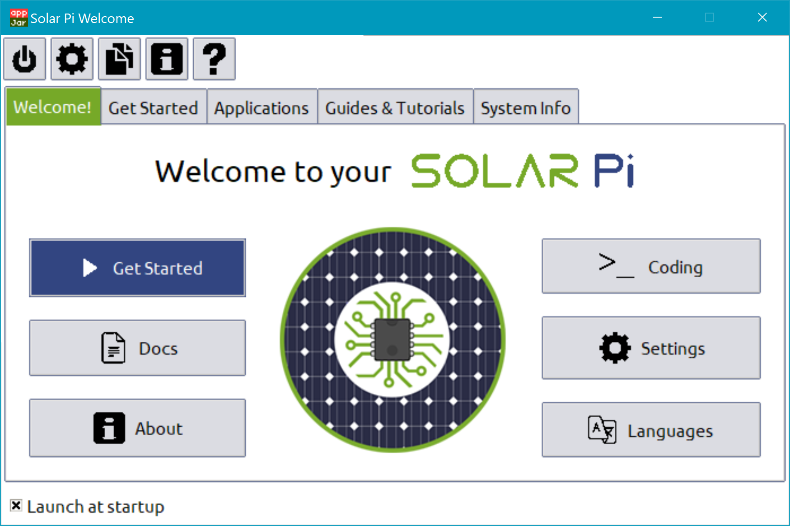

# Solar Pi
All custom software for the Solar Pi STEM project.

Includes software to:
* Get the user more familiar with using a computer
* Teach them how to code
* Manage power
* Change settings that are specific to the Solar Pi

Check out the [wiki](https://github.com/The-Sleepy-Penguin/Solar-Pi-Core/wiki) to install on Raspbian.
